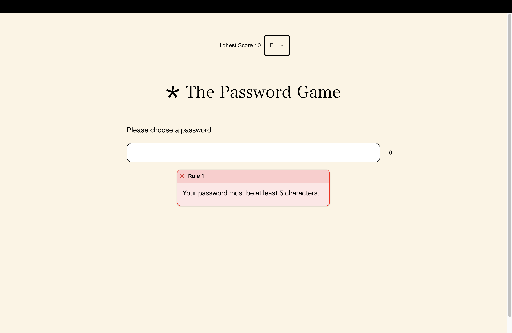
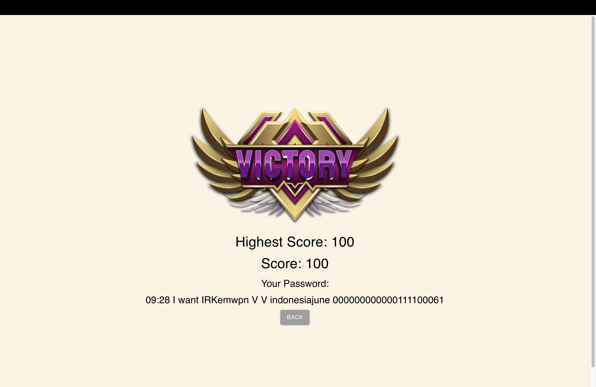
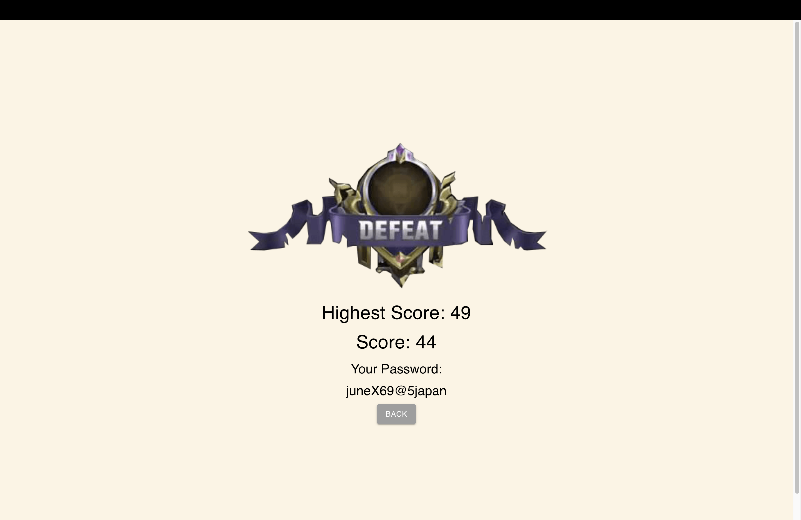

## App Description

```
This app is an enthralling adaptation of the [Game](https://neal.fun/password-game/)
where users are challenged to create a password that adheres to specific rules. 
Each rule appears sequentially as the previous one is fulfilled. 
There are a total of 20 unique and captivating rules. 
Give it a try and experience the excitement!
```

## Frameworks

```bash
Programming Language: JavaScript, HTML, CSS
Frontend Framework: React.js
Backend Framework: Express.js
Database: MongoDB
Package Management Tool: npm
```

## Program's Structure
```bash
/backend: The main directory for the application's backend source code, managing data from the database.  
/src: The main directory for the application's frontend source code, managing UI.  
/src/components: React components for the user interface, including views for game mode selection, rules, and forbidden letter selection.  
/src/pages: The main game page and result page, with the overall game algorithm located on the homepage.  
/utils: Utility functions for password identification algorithms according to the given rules.  
/public: Contains static files such as index.html and other assets.
```


## Regex Algorithm (Regular Expression)
```bash
Regular Expressions (Regex) are algorithms used for matching and manipulating strings based on specific patterns. In the context of this application, regex is utilized to find and replace substrings within a string based on certain patterns.
```
#### Reasons for Usage:
```bash
Efficiency: Regex is a highly efficient tool for pattern matching and string manipulation, 
            especially when the searched patterns have a fixed structure and can be dynamically configured.
Flexibility: By using regex, you can easily adjust search and replace patterns according to the application's needs. 
             Regex allows for complex search and replacement operations in a single line of code.
```

## How to run
```bash
1. Clone this Repo or Download the release's version
```
```bash
2. npm install #download all the dependencies needed.
```
```bash
3. npm run start #backend and frontend are running concurently.
```

## Screenshot





## Study References
[MongoDB](https://www.mongodb.com/docs/)
[Image Saving in Database](https://www.mongodb.com/community/forums/t/how-to-save-an-image-in-mongodb-and-use-it-later-in-my-html/243643/2)
[MUI](https://mui.com)
[PostMan](https://learning.postman.com/docs/introduction/overview/)
